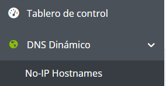

# Documentación de HTTPS con Let’s Encrypt y Certbot

Este es la continuación del proyecto 1.4, para ver la documentación de este haz click en el siguiente [enlace](https://github.com/ArturoCarrilloJimenez/Practica-daw-1.4)

Vamos ha realizar la instalación y configuración de un certificado SSL/TLS con Let’s Encrypt y Certbot en el servidor web Apache

Let’s Encrypt es una autoridad de certificación que proporciona certificados gratuitos para el cifrado de la capa de trasporte

Tendremos la misma estructura que el ejercicio anterior, solo hemos añadido el archivo ``setup_letsencrypt_certificate.sh``, en este archivo deberemos de tener la estructura básica

``` sh
#!/bin/bash

set -ex

source .env
```

En primer lugar realizaremos la instalación y actualización de snap, esto lo realizaremos con las siguientes dos lineas

``` sh
snap install core
snap refresh core
```

Para asegurar posteriormente la instalación de cerbot eliminaremos este mediante apt

``` sh
apt remove certbot -y
```

Una vez eliminado cerbot realizaremos su instalación para demostrar que tenemos control de nuestro dominio

``` sh
snap install --classic certbot
```

Posteriormente creare un alias o enlace simbólico de cerbot mediante el comando ``ln -fs /snap/bin/certbot /usr/bin/certbot``

Antes de solicitar el certificado debemos de añadir 2 variables a nuestro archivo ``.env`` para posteriormente solicitarlo

```
LE_EMAIL="Your_email"
LE_DOMAIN="Domain"
```

Para opener un dominio gratuito utilizaremos __No-IP__, en primer lugar debemos de hacer login y irnos al siguiente apartado ```DNS Dinámico > No-IP Hostname``



Aquí haremos clic a el botón __Crear nombre de host__ y se nos abrirá una ventana donde pondremos el __nombre de dominio, elegiremos una de sus extensiones y asignaremos la ip-elástica__

En la variable ``LE_DOMAIN`` pondremos el __host domine__ que hemos creado con __No-IP__

Para finalizar solicitaremos el certificado mediante el comando

``` sh
certbot --apache -m $LE_EMAIL --agree-tos --no-eff-email -d $LE_DOMAIN --non-interactive
```